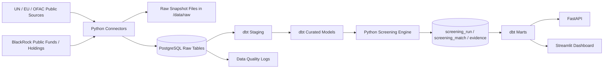
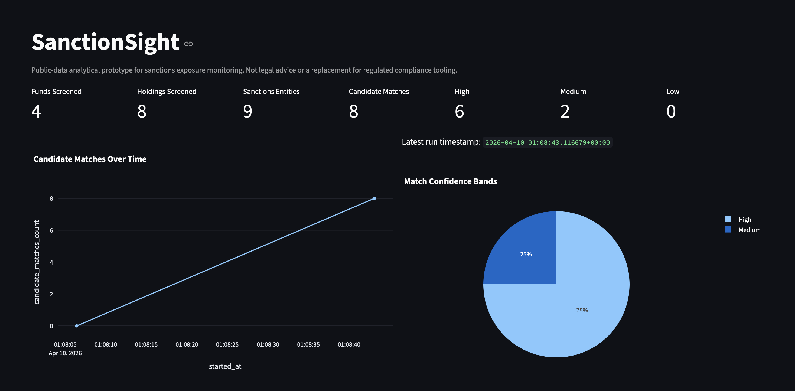
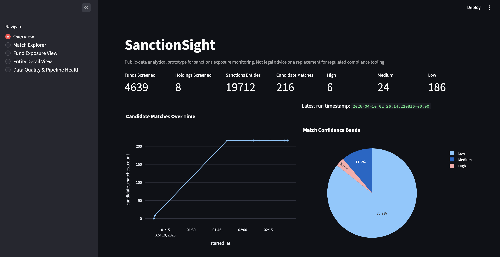
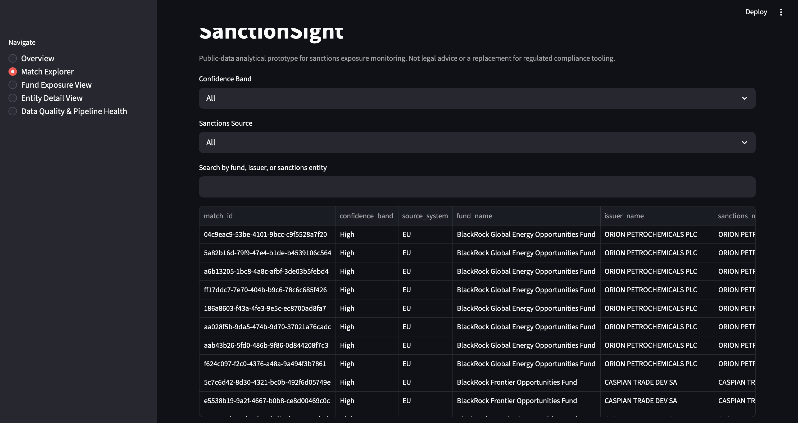
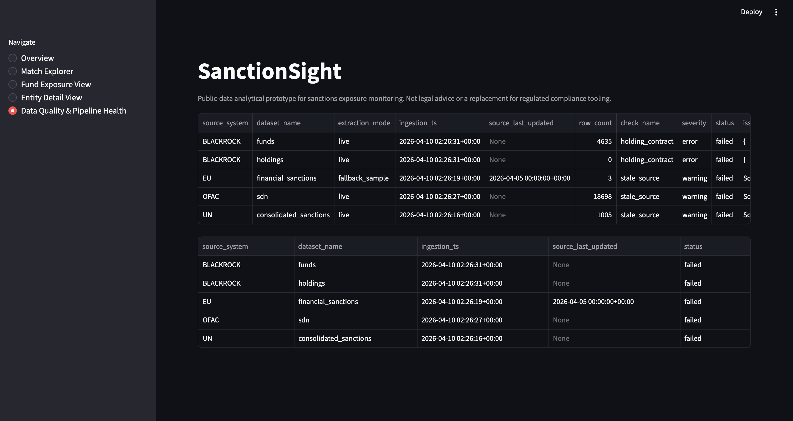

# SanctionSight: End-to-End Sanctions Screening Pipeline for Public Investment Funds

SanctionSight is a production-style portfolio project that ingests public sanctions data from the United Nations, European Union, and OFAC, combines it with public BlackRock-style fund and holdings data, and screens holdings for potential exposure to sanctioned or similarly named entities.

This repository is intentionally framed as a **public-data analytical prototype** for exposure monitoring and entity-resolution practice. It is **not legal advice**, **not a replacement for regulated sanctions compliance tooling**, and **all candidate matches require human review**.

## Project Origin

I began building SanctionSight as a personal project after encountering sanctions exposure monitoring challenges at IMGP and wanting to explore how an end-to-end data platform could support this workflow using public data. I used the project to translate that real-world problem into a production-style analytics and engineering implementation, with a focus on multi-source ingestion, warehouse modeling, entity normalization, explainable matching, and analytical delivery through APIs and dashboards.

## Why This Project Matters

This project demonstrates the kind of end-to-end delivery expected from a senior data engineer or analytics engineer:

- Multi-source ingestion across heterogeneous public datasets.
- Raw-to-mart warehouse modeling with a medallion-style architecture.
- Entity normalization, alias handling, and fuzzy matching for analytical entity resolution.
- Production-minded orchestration, data quality controls, and operational metadata capture.
- Internal API and BI-style dashboard delivery on top of warehouse-ready marts.

## Architecture Summary

SanctionSight uses PostgreSQL for raw, screening, and serving-layer persistence; dbt for staging, curated, and mart transformations; Prefect for orchestration; FastAPI for internal access; and Streamlit for analytical exploration. Python connectors capture raw snapshots to disk and database metadata tables, then dbt standardizes those records, and a RapidFuzz-based screening engine generates candidate matches and evidence rows.



## Core User Outcomes

- View how many funds were screened.
- View how many unique holdings were screened.
- View how many sanctions records were loaded.
- View how many candidate matches were found.
- View confidence bands across High, Medium, and Low candidates.
- See which funds contain possible sanctioned or similarly named entities.
- Break down matches by sanctions source.
- Track run history, source freshness, and pipeline health.
- Drill into entity-level evidence and matching explanations.

## Tech Stack

- Python 3.12
- Poetry
- Docker and Docker Compose
- PostgreSQL
- dbt-core and dbt-postgres
- Prefect
- FastAPI
- Streamlit
- Pandas and Polars
- RapidFuzz
- SQLAlchemy
- Alembic
- Pandera
- Pytest
- structlog
- Optional DuckDB for local experimentation

## Repository Layout

```text
app/                 Core ingestion, normalization, matching, and persistence logic
api/                 FastAPI service
dashboards/          Streamlit dashboard
orchestration/       Prefect flows
dbt/                 dbt staging, curated, and mart models
data/                Raw snapshots, cache, and deterministic sample data
tests/               Unit and integration tests
docs/                Architecture, source notes, and screenshot placeholders
alembic/             Database migrations
scripts/             CLI entrypoints
infra/               Infra-related placeholders
notebooks/           Exploration notebooks
```

## Medallion Data Model

### Raw

- `raw_source_snapshot`
- `raw_sanctions_record`
- `raw_blackrock_fund_record`
- `raw_blackrock_holding_record`

### Staging

- `stg_raw_sanctions_entities`
- `stg_raw_blackrock_funds`
- `stg_raw_blackrock_holdings`

### Curated

- `int_curated_sanctions_entities`
- `int_curated_funds`
- `int_curated_holdings`

### Screening

- `screening_run`
- `screening_match`
- `screening_match_evidence`
- `data_quality_issue`

### Marts

- `mart_screening_overview`
- `mart_fund_exposure`
- `mart_entity_matches`
- `mart_pipeline_health`

## Matching Logic

The screening engine compares normalized holdings against curated sanctions entities using:

- Exact normalized name matching
- Alias matching
- Identifier matching when available
- RapidFuzz token sort ratio
- RapidFuzz token set ratio
- RapidFuzz partial ratio
- Country overlap boosts
- Entity-type penalty for likely individual/entity mismatches

Confidence bands are configuration-driven:

- `High`: identifier match or very strong exact/alias support with supporting attributes
- `Medium`: strong fuzzy similarity above the medium threshold
- `Low`: weaker but still reviewable candidates retained for transparency

## Data Quality Controls

SanctionSight includes checks for:

- Null critical fields
- Duplicate source records
- Malformed identifiers
- Stale source timestamps
- Contract/schema failures
- Run-level data quality issue persistence for dashboard visibility

## Dashboard Pages

### Overview

- KPI cards for funds, holdings, sanctions entities, candidate matches, and confidence bands
- Match trend over time
- Sanctions records by source

### Match Explorer

- Filter by confidence band
- Filter by sanctions source
- Search across fund, issuer, and sanctions entity names
- Review match explanations and score context

### Fund Exposure View

- Ranked table of funds with candidate match counts
- Drill into a fund’s flagged holdings

### Entity Detail View

- Sanctions profile, aliases, provenance, and linked fund matches

### Data Quality & Pipeline Health

- Ingestion status
- Row counts by source
- Freshness indicators
- Latest quality findings

## API Endpoints

- `GET /health`
- `GET /runs/latest`
- `GET /metrics/summary`
- `GET /funds`
- `GET /funds/{fund_id}`
- `GET /matches`
- `GET /matches/{match_id}`
- `GET /entities/sanctions`
- `GET /entities/holdings`

## Local Setup

### 1. Install dependencies

```bash
cp .env.example .env
poetry install
```

### 2. Start PostgreSQL

```bash
docker compose up -d postgres
```

### 3. Apply migrations

```bash
poetry run alembic upgrade head
```

### 4. Run the orchestration / pipeline

The pipeline ingests raw data, writes snapshots, executes dbt staging/curated models, runs the screening engine, and refreshes marts.

```bash
poetry run python -m scripts.run_pipeline
```

You can also execute the Prefect flow directly:

```bash
poetry run python -m orchestration.prefect.flows
```

### 5. Run dbt transforms and tests independently

These commands are useful after data has already been ingested.

```bash
poetry run dbt run --project-dir dbt --profiles-dir dbt
poetry run dbt test --project-dir dbt --profiles-dir dbt
```

### 6. Run the API

```bash
poetry run uvicorn api.main:app --host 0.0.0.0 --port 8000 --reload
```

### 7. Run the dashboard

```bash
poetry run streamlit run dashboards/streamlit_app/main.py --server.port 8501
```

### Common shortcuts

```bash
make up
make migrate
make pipeline
make dbt-run
make dbt-test
make api
make dashboard
make test
```

## Sample Data and Fallback Mode

Public websites and holdings pages can change over time, so the project includes a deterministic sample mode:

- `SAMPLE_DATA_MODE=true` uses local sample sanctions, fund, and holdings data.
- `ALLOW_LIVE_FETCH=false` keeps the project offline-safe for demos.
- Connectors still persist raw snapshot files and metadata exactly as they were ingested in that run.
- BlackRock connectors intentionally preserve a cached snapshot path for demo reliability.

### Demo Dataset Profile

The included sample mode is sized to make the project easy to run locally while still demonstrating realistic screening behavior:

- 4 public fund records
- 8 holdings records
- 9 sanctions records across UN, EU, and OFAC
- Deliberate identifier, exact-name, alias, and fuzzy-match scenarios

This means you can walk a reviewer through multiple match-confidence patterns without needing a fragile live scrape during the demo.

## Source Notes

- UN consolidated sanctions list connector included, anchored to the official Security Council consolidated list page and its XML export.
- EU financial sanctions list connector included, anchored to the official `data.europa.eu` dataset page and its XML export.
- OFAC sanctions list connector included, anchored to the official Sanctions List Service and its SDN XML export.
- BlackRock-style public product and holdings connectors included with deterministic fallback.

The connector layer is intentionally interface-driven so additional providers or sanctions sources can be added without rewriting downstream transforms and matching logic.

## Assumptions

- This portfolio project optimizes for repeatable local demos over legal-grade coverage.
- Sample datasets are synthetic but shaped like realistic records to exercise pipeline behavior.
- BlackRock live extraction is treated as fragile and therefore defaults to cached/sample mode.
- Matching thresholds are calibrated for explainable demo outputs, not regulatory production use.
- The PostgreSQL `public` schema is sufficient for a local portfolio implementation.

## Known Limitations

- Live EU and BlackRock source structures may change and require connector updates.
- The current matching engine is pairwise and intended for small-to-medium analytical workloads.
- Security identifiers are sparse in sanctions data, so name-based screening remains approximate.
- Review workflow is lightweight and does not include a full case-management UX.
- dbt freshness checks are represented through source metadata and marts, not external alerting integrations.

## Future Enhancements Backlog

- Add UK sanctions data as another source connector.
- Build a manual review queue with accepted/rejected dispositions and audit history.
- Add Slack or email alerts for newly detected high-confidence matches.
- Track historical snapshot deltas and exposure changes between runs.
- Add graph-based relationship exploration across aliases, issuers, and sanctions entities.
- Introduce vector or phonetic blocking strategies for higher-scale candidate generation.
- Add provider catalogs for more asset managers beyond BlackRock.

## Demo Results

Representative local demo runs produced the following outputs:

- Sample-mode prototype run: 4 funds screened, 8 holdings screened, 9 sanctions entities loaded, and 8 candidate matches identified.
- Expanded sanctions demo run: 4,639 BlackRock fund records loaded from the provided BlackRock workbook, 19,712 sanctions entities loaded, and 216 candidate matches surfaced across High, Medium, and Low confidence bands.
- Dashboard pages demonstrate KPI monitoring, confidence distribution, match exploration, and pipeline health visibility for resume and interview walkthroughs.

## Screenshots

### Overview: Sample Run



### Overview: Expanded Run



### Match Explorer



### Data Quality And Pipeline Health



See [`docs/screenshots.md`](docs/screenshots.md) for the screenshot inventory.

## Tradeoffs and Framing

SanctionSight prioritizes explainability, modularity, and local reproducibility. It is intentionally scoped as an analytical prototype for public data screening, not a legal compliance product. Candidate matches are surfaced to support research and monitoring workflows and should always be validated by a human reviewer.
